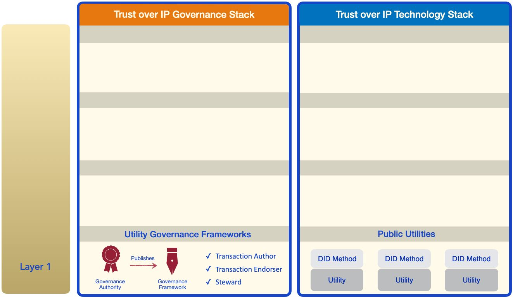

# Layer One: Public Utilities

The first two layers of the ToIP stack are designed to provide ​**technical trust**​ — the
assurance that one machine can establish a secure, private connection with another
machine. To do this using ​ [public key cryptography]​(https://en.wikipedia.org/wiki/Public-key_cryptography), you must be able to strongly verify the ​**public key**​ of the party you are connecting to. The [W3C Decentralized Identifier (DID) specification​](https://www.w3.org/TR/did-core/) solves this problem without using centralized​ [certificate authorities](https://en.wikipedia.org/wiki/Certificate_authority) by standardizing how you can permanently identify and verify a public key stored on a blockchain or other distributed system.  
This solution gives rise to public utilities that serve as strong **cryptographic
roots-of-trust**​ for the DIDs and public keys of verifiable credential issuers. ToIP Layer
One utilities can be implemented using any technology that can provide the necessary
trust assurances, e.g., blockchains (of any kind), distributed ledgers, decentralized file
systems, distributed hash tables, and so on.

Although technical trust is machine-to-machine, implementing technical trust still
requires humans to design, code, test, and certify these systems. This is the job of
Layer One **utility governance frameworks​** that specify the policies under which a
utility is implemented and operated such that it can be trusted by the higher layers.