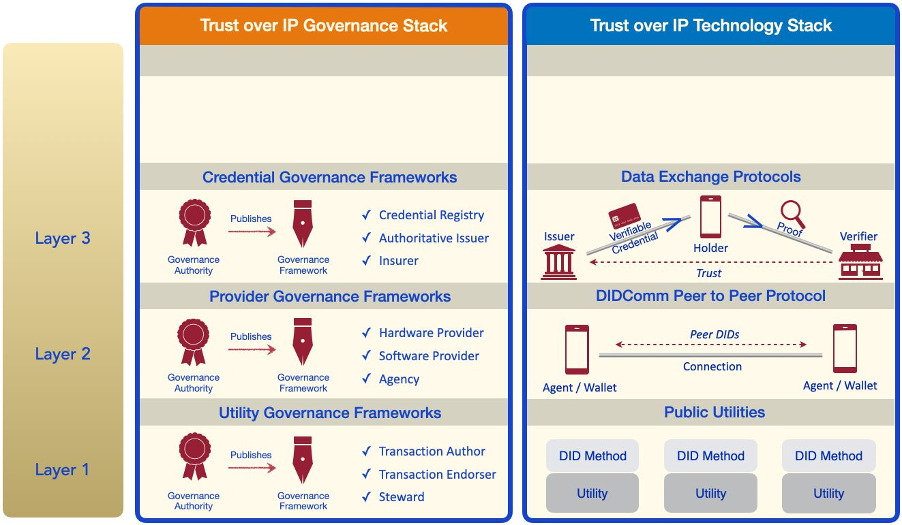

Layers Three and Four are where ​**human trust​** is established and maintained. On the
technical side of the stack, Layer Three is the home of the​ **verifiable credential trust
triangle**​ discussed in Part Three. This is the layer where issuers, holders, and verifiers
exchange credentials and proofs using  **credential exchange protocols**​ that run on top
of DIDComm. Note that these are just one example of the kind of trusted data exchange
protocols that can operate at Layer Three — many other types of secure messaging and
workflow automation protocols can be implemented at this layer.

On the governance half of the stack, Layer Three is where the **governance trust
triangle**​ comes into full play. Almost any digital credential that will be issued by multiple issuers and/or accepted by a wide range of verifiers needs a ​**credential governance framework​**. It will define what issuers will issue what credentials under what policies to what holders with what level(s) of assurance — and under what trust mark(s). This is the information verifiers need to make their own trust decisions about relying on a proof from the credential — just as the Mastercard operating rules tell merchants exactly what they can expect when accepting a Mastercard.