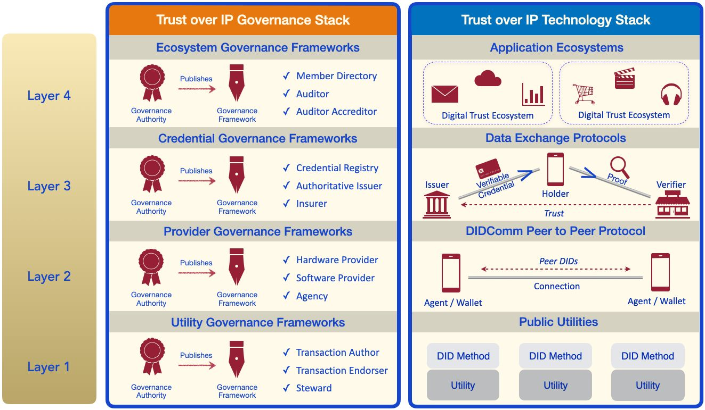

Layer Four is the application layer — the layer where humans interact with applications in
order to engage in trusted interactions that serve a specific business, legal, or social
purpose. Just as Internet-enabled applications call the TCP/IP stack to communicate
over the Internet, ToIP-enabled applications call the ToIP stack to register DIDs, form
connections, obtain and exchange verifiable credentials, and engage in trusted data
exchange using the protocols in Layers One, Two, and Three.

Layer Four is specifically designed to enable ​**digital trust ecosystems**​ — entire families of applications and credentials that are not only designed to interoperate technically, but  which share a common ​**ecosystem governance framework**​. This specifies the purpose, principles, and policies that apply to all governance authorities and govern-
ance frameworks operating within that ecosystem — at all four layers of the ToIP stack.  
An ecosystem governance framework can enable nearly frictionless data exchange
between apps, sites, and businesses while providing a consistent user experience of
security, privacy, and data protection across the ecosystem that can be as important to
consumer confidence as a consistent user experience of the controls for driving a car
(steering wheel, gas pedal, brakes, turn signals) are to driver safety around the world.