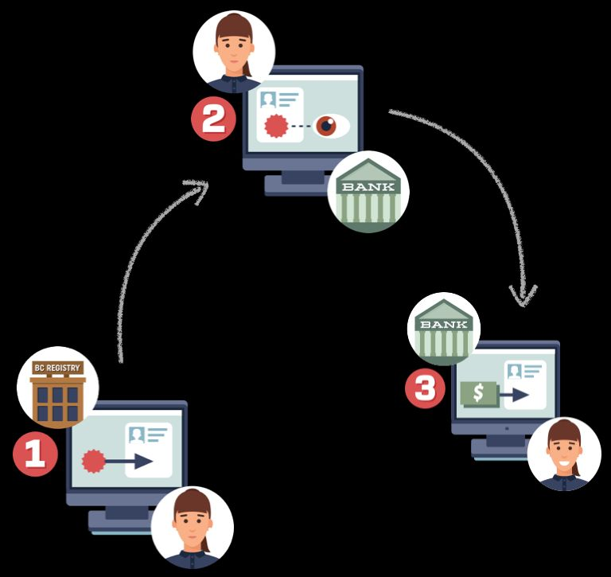

There are obvious reasons we didn’t immediately port our long-established real-world
trust model of physical credentials to the digital world. Physical credentials are both
relatively easy to produce (via conventional printing/stamping technology), and relatively
easy to verify (via human inspection, if we accept a reasonable degree of error). Digital
credentials are much harder. They were a bridge too far when the Internet was young.  
But now that is maturing, the benefits of introducing digital credentials would be
enormous. Each of us could obtain credentials in a digital wallet just like we obtain
physical credentials today. Imagine how much simpler the journey would be for a
business owner like Sally, shown below. In step one she could obtain a digital license
for her business. In step two she could take that credential to a bank to open a business
bank account. In step three she can take both the business license and banking
credential to another government agency to obtain a small-business loan—all online.

