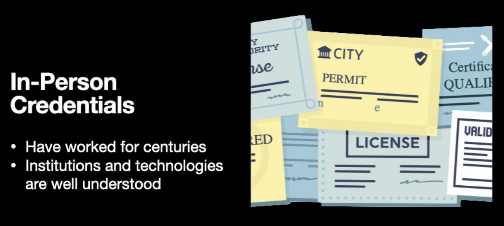

In the era before digital networks—when relationships and business interactions were all managed face-to-face—we had evolved a simple, universal, decentralized mechanism for achieving trust. We used credentials of all kinds.

Note that by “credentials” we don’t just mean the pieces of paper or plastic that you carry around in your wallet to prove your identity, for example, driving licenses, government IDs, employment cards, credit cards, and so on. We mean any document of any size that enables you—or your organization—to prove something about you that enables the establishment of trust. For example, this could include:

* A birth certificate issued by a hospital or vital statistics agency that proves when
and where you were born and who were your parents.
* A business registration or license of any kind that proves you are authorized to
conduct a specific type of business.
* A diploma issued by a university that proves you have an educational degree.
* A passport issued by a government of a country that proves you are a citizen.
* An official pilot’s license that proves you can fly a plane.
* A utility bill that proves you are a registered customer of the utility.
* A power of attorney issued by the appropriate authority within a jurisdiction that proves that you can legally perform certain actions on behalf of another person.
