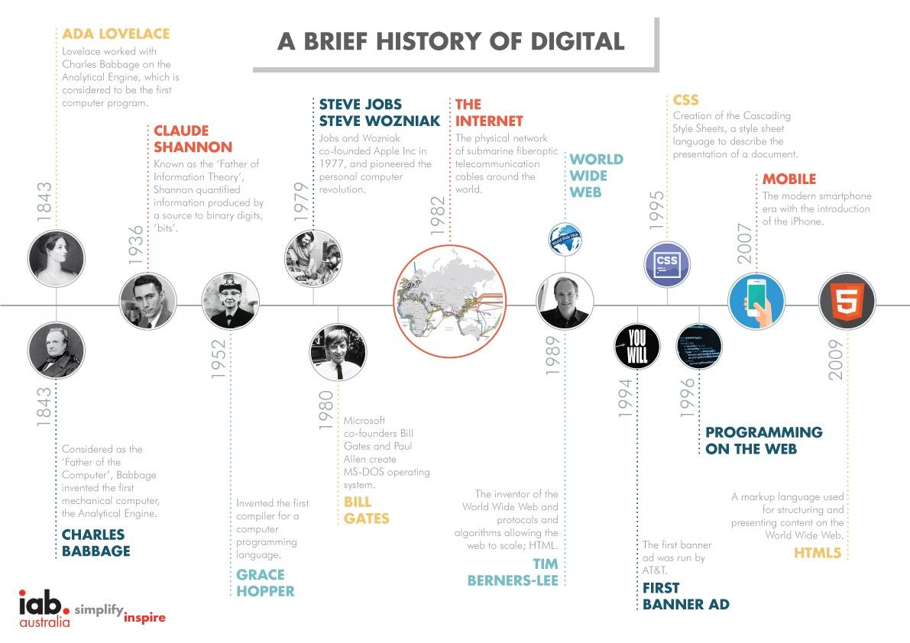

# Moving Online

With the widespread consumer and business adoption of the Internet starting in the late
1990s, we moved into a new era of online relationships and digital interactions. The
following ​ [diagram from IAB Australia​](https://www.iabaustralia.com.au/iab-blog/blog-articles/entry/a-brief-history-of-digital-it-s-always-good-to-reflect) puts this journey in perspective.

It’s easy to forget that, with the Internet of today where consumers and businesses
across all sectors participate in a global digital economy of unprecedented scale and
complexity, *it did not start out that way*.​ As little as forty years ago, we were still working on individual “personal computers” that did not even connect to a network.  
Then came “sneakernets”, single-office networks, local-area networks (LANs), dial-up
networks (Compuserve, MCI Mail, AOL), and finally the worldwide “network of networks”
now known as the Internet. And at each step, the gap between how we establish trust
offline and how we do it online was widening. Why?