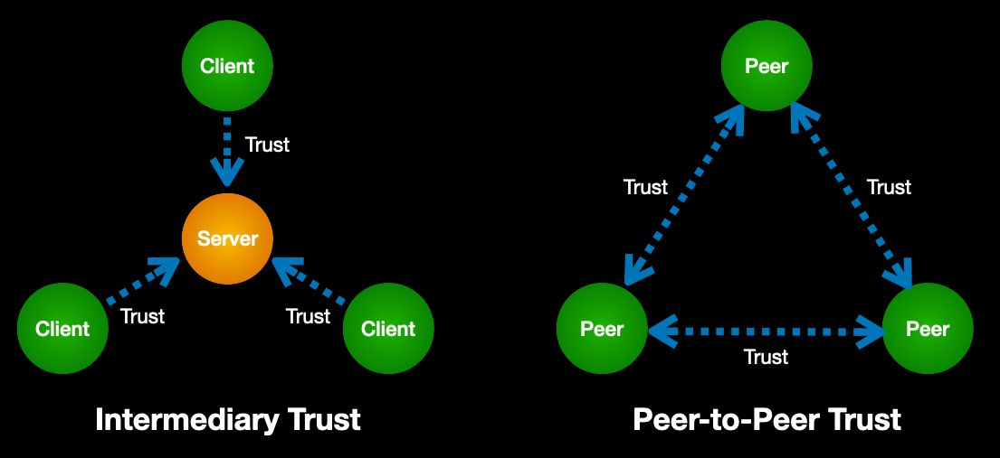

It is easy to spot the fundamental problem with intermediaries by looking at the ​**trust
model​** — how trust actually flows between the parties. In the current account-based
client-server paradigm, all trusted interactions must be mediated by a server — and all
parties must be integrated with that server. Whoever controls this server must be
trusted by all the parties to the interaction. This is the model shown on the left below.

Contrast this with the peer-to-peer trust model on the right. No intermediaries needed.
No server integration needed. Every peer forms trust relationships directly with every
other peer. Each peer determines its own policies for trusting another peer.  
This, ironically, is exactly how the trust model for real-world credentials work. Each peer
is a holder of its own credentials and a verifier of another peer’s credentials. Any peer
can be an issuer of credentials when needed.  
This is the root cause of our trust gap. Our current Internet trust model requires
intermediaries that are not natural in a decentralized, peer-to-peer trust model. What’s
worse, the prevailing Internet “surveillance economy” business model incents these
intermediaries — otherwise known as “platforms” — to monetize these private interactions,
creating significant privacy issues and further widening the trust gap.  
No such incentives exist for the peer-to-peer trust model. So how do we reclaim it?