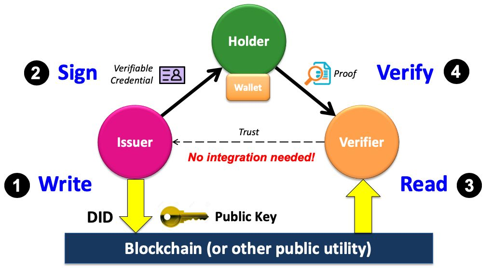

# The Verifiable Credential Trust Triangle

Thankfully the promise of digital credentials was recognized several years ago by
pioneers at the World Wide Web Consortium (W3C). They began the effort to
standardize the file formats and digital signatures needed. The result was ​ [the Verifiable
Credentials Data Model 1.0 specification](https://www.w3.org/TR/vc-data-model/), approved as a full W3C standard in
September 2019. Below is a diagram showing how verifiable credentials work.

1. First the issuer writes a Decentralized Identifier (DID) together with its public key
(and any other cryptographic material needed for the issuer’s verifiable
credentials) to a blockchain (or other sufficiently trusted public utility).
2. Second, the issuer uses its private key to digitally sign a verifiable credential it
issues to a qualified holder, who stores it in her own digital wallet. Note that for
privacy preservation, this entire issuance process takes place ​**off-chain​**.
3. Third, a verifier requests a digital proof of one or more credentials from the
holder. If the holder consents, the holder’s wallet generates and returns the
proofs to the verifier. Since the proofs contain the issuer’s DID, the verifier uses it
to read the issuer’s public key and other cryptographic data from the blockchain.
4. In the final step, the verifier uses the issuer’s public key to verify that the proofs
are valid and that the digital credential has not been tampered with.